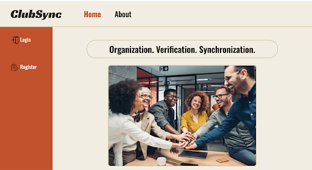
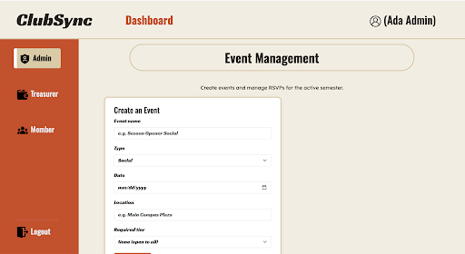
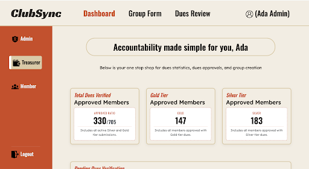
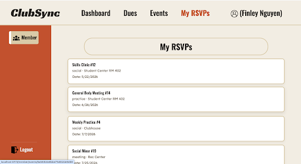
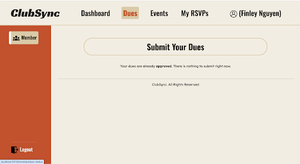
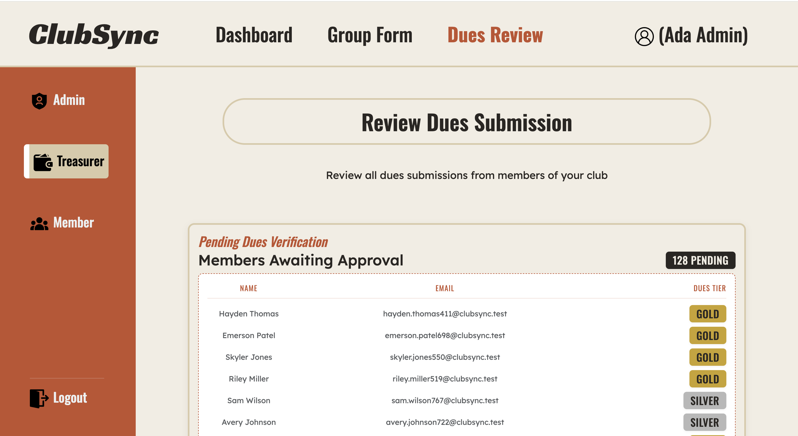
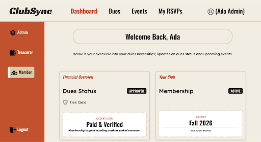

# ClubSync

ClubSync replaces the manual Google Forms + spreadsheet workflow that student clubs use to track dues and manage event access. Admins create and run their club, treasurers review dues, and members can only RSVP to events they're eligible for based on their approved dues tier — eliminating the manual cross-referencing.

## Authors

- Sean Behan
- Julian Leonhardt

## Class

CS 5610 / Web Development — Northeastern University · [Class Link](https://johnguerra.co/classes/webDevelopment_online_summer_2026/)

## Live Site 
Deployed on Render using its free tier service· [ClubSync Web App Link](https://clubsync-lfuo.onrender.com/)

## Video Demonstration
Demonstration video briefly explaining how to use ClubSync, from a user perspective and how it works behind the scenes · [YouTube Video Link](https://www.youtube.com/watch?v=1FwJAOmcqcg)

## Project Slides
A Presentation that outlines how the development of the project went (what we struggled on and what we learned) · [Google Slides Link](https://docs.google.com/presentation/d/1DyRUH6mBH0AyMOU-kNr2XrI8XPQqQDpaqNsjXyMaoMo/edit?usp=sharing)

## Project Objective

Clubs waste time every semester copying names into spreadsheets and cross-checking who has paid before letting members into events. ClubSync centralizes this into one app. It is **multi-club**: each club is independent, with its own members, events, and dues, and users only ever see their own club's data.

Three roles:

- **Admin** — registers and creates the club (which generates a join code), creates events and sets the dues tier required to attend, views each event's RSVP list, and manages members (including promoting a member to treasurer).
- **Treasurer** — reviews dues submissions, sees a running total of collected dues by tier, and can start a fresh semester (regenerates the join code and resets the roster). Treasurers are promoted by an admin.
- **Member** — joins a club with its join code, submits dues with a tier and payment reference, and RSVPs to events they're eligible for (with a clear message when they're not).

Access is hierarchical: `member < treasurer < admin`. To get started, an admin registers and names their club; everyone else registers as a member and joins with the club's join code.

## Screenshots

**Home**



**Admin — Event Management** (create events, view/manage RSVPs)



**Admin / Treasurer view**



**Member — My RSVPs**



**Dues — overview, submission, and status**





## Tech Stack

- **Runtime / Server:** Node.js + Express (ES modules)
- **Database:** MongoDB (native MongoDB Node.js driver — no Mongoose)
- **Authentication / Sessions:** Passport (local strategy) with bcrypt password hashing; express-session backed by connect-mongo (sessions stored in MongoDB)
- **Frontend:** React 19 with client-side rendering, built with Vite; React Router for routing; PropTypes for prop validation
- **HTTP:** the browser's native `fetch` (no Axios); no CORS (frontend is served by the same Express server, proxied in dev)
- **Styling:** Bootstrap 5.3 + React-Bootstrap components, plus per-component CSS files
- **Tooling:** ESLint + Prettier; dotenv for environment config
- **Synthetic data:** a custom Node.js seed script (`npm run seed`) that generates ~1,300 internally-consistent records directly via the MongoDB driver (no external generator)

_Deliberately avoids the prohibited libraries: no Mongoose, no Axios, no CORS._

## Getting Started

### Prerequisites

- Node.js 18+
- A MongoDB connection string (MongoDB Atlas or local `mongod`)

### 1. Backend

```bash
# from the project root
npm install
```

Create a `.env` file in the project root (see `.env.example`):

```
MONGO_URI=<your MongoDB connection string>
PORT=3000
SESSION_SECRET=<any long random string>
```

Build the frontend so the server can serve it, then start the backend:

```bash
cd frontend && npm install && npm run build && cd ..
npm start
```

The app is served at **http://localhost:3000**.

### 2. Frontend (development mode)

For live-reloading during development, run the Vite dev server in a second terminal:

```bash
cd frontend
npm run dev
```

Open **http://localhost:5173** — API requests are proxied to the backend on port 3000.

### 3. Seed the database (1,000+ records)

```bash
npm run seed
```

This populates all four collections with ~1,300 consistent synthetic records across **three independent clubs** — each with an admin, a treasurer, ~230 members with realistic dues states, and ~14 events with eligibility-consistent RSVPs. It is safe to re-run — it only clears its own seed data.

## Login Credentials

After running `npm run seed`, log in with any seeded account. **All seeded accounts use the password `password123`.**

| Role                     | Email                          | Password      |
| ------------------------ | ------------------------------ | ------------- |
| Admin                    | `seed.admin@clubsync.test`     | `password123` |
| Treasurer                | `seed.treasurer@clubsync.test` | `password123` |
| Member — approved gold   | `finley.nguyen4@clubsync.test` | `password123` |
| Member — approved silver | `parker.lee0@clubsync.test`    | `password123` |
| Member — no dues yet     | `casey.brown1@clubsync.test`   | `password123` |

All five demo accounts belong to the same club (**Chess Club — Fall 2026**, join code `482913`). The three member accounts have different dues states, which is handy for demonstrating event RSVP eligibility (a gold-tier event accepts the gold member and blocks the silver and no-dues members). You can also register a new **admin** to create your own club, or register a **member** and join a club with its join code.

## Using the App

### Getting into a club

- **Register as an Admin** to start your own club — you name it at sign-up and become its owner. The club is created with a unique **join code** you share with members.
- **Register as a Member** to join an existing club — after signing up, enter that club's join code on your dashboard to get on the roster.

Everything you see (events, dues, members) is scoped to your club. Users never see another club's data.

### The dues flow

1. A **member** submits dues from their dashboard: they pick a tier (**silver** or **gold**) and enter a **payment reference** (e.g. a Venmo confirmation or check number). Their status becomes **pending**.
2. The submission lands in the **treasurer's** review queue. The treasurer opens **Dues Review**, sees each pending submission with its tier and payment reference, and **approves** or **denies** it. A denial **requires a note** explaining why.
3. On **approval**, the member's dues status flips to **approved** and their tier is locked in — this is what unlocks tiered events. On **denial**, the member sees the reason and can resubmit.
4. A member can **withdraw** their own submission while it's still pending (in case they made a mistake) — after that it's the treasurer's to decide.
5. The treasurer dashboard shows a **running total of collected dues, broken down by tier**, so there's no manual tallying.

### The events flow

1. An **admin** creates an event (name, type, date, location) and sets the **required dues tier**: `none`, `silver`, or `gold`.
2. The event shows up for that club's members on their dashboard and the Events page.
3. A **member** RSVPs from the event. Eligibility is checked automatically:
   - **`none`** events are open to everyone.
   - **tiered** events require **approved** dues **at or above** the required tier. If the member isn't eligible, they get a clear message telling them what's needed (e.g. "This event requires the gold tier") instead of a silent failure.
4. The **admin** can view each event's **RSVP list** to plan logistics, and can **edit** or **cancel** (delete) an event.

### Appointing treasurers and admins

- Treasurer is **never self-selected** at registration — an **admin** grants it.
- On the admin's **Club Members** page, the admin sees the club roster and can change any member's role to **treasurer** or **admin**. A club can have more than one admin.
- Role changes are scoped to the admin's own club — an admin can't touch members of a club they don't run.

### Starting a new semester

- A **treasurer** can start a new semester for their club. This keeps the **same club** but issues a **fresh join code** and **clears the roster**: members are removed and must re-join with the new code, while the admin/treasurer stay on to run the term. Pending dues from the old term are archived. It's a clean slate for the new semester, not a brand-new club.

## Available Scripts

**Backend (project root):**

| Command            | Description                                             |
| ------------------ | ------------------------------------------------------- |
| `npm start`        | Start the Express server                                |
| `npm run seed`     | Populate the database with synthetic records            |
| `npm run db:reset` | Wipe **every** collection for a clean slate (then seed) |
| `npm run lint`     | Lint the backend                                        |

**Frontend (`frontend/`):**

| Command         | Description                 |
| --------------- | --------------------------- |
| `npm run dev`   | Start the Vite dev server   |
| `npm run build` | Build the production bundle |
| `npm run lint`  | Lint the frontend           |

## Known Limitations & Future Work

Things we scoped out for this version but would build next:

- **One club per member.** A user belongs to a single club at a time. We'd like a member to join and switch between **multiple clubs** from one account (e.g. a shared "my clubs" switcher), which would mean moving from a single `groupId` on the user to a membership relationship.
- **No dues history.** We only keep each member's _current_ dues state; starting a new semester archives the old term rather than exposing it. A per-semester **history / receipts view** would help treasurers with reporting.
- **No notifications.** Approvals, denials, and semester resets are only visible in-app. **Email notifications** would close the loop so members don't have to keep checking.
- **Manual payment references.** Members type in a Venmo/check reference that the treasurer eyeballs. A real **payment integration** (Stripe/Venmo) would remove the manual verification step entirely.
- **No event capacity or waitlists.** Events currently accept unlimited RSVPs.
- **No audit log.** Role changes and dues decisions aren't recorded beyond the resulting state; an audit trail would make hand-offs between officers safer.

## AI Use Disclosure

-Julian

I used an AI assistant (Claude Code, by Anthropic) during development, primarily as a **mentor/tutor rather than a code generator**.

**Initial prompt.** I set up the collaboration explicitly at the start:

> Act as my professor and someone who has 15 years of experince as a full-stack developer help me with the concepts of the project. I will be writting all of the code unless I specificly ask you to which will only be for boilerplate.

I also gave it the project proposal so that the agent understood the role I was given and the ideas I had to work on.

**How I used it:**

- **I wrote most of the code myself.** For each feature the assistant explained the approach and structure, I implemented it, and then it reviewed my drafts — catching bugs (missing `await`, field-name mismatches, scope/bracket errors, template-literal vs. single-quote mistakes) and explaining the concepts behind them (React hooks, controlled inputs, `useEffect`, Express routing/middleware, MongoDB queries, HTTP status codes).
- **I asked it to write some boilerplate/tooling for me** — the database seed script, a few component templates and the CSS styling, and this README — all of which I reviewed before keeping.
- **Testing/tooling:** it ran linting, formatting, and end-to-end tests, and helped debug by exercising the API directly.
- **Design decisions** (role hierarchy, event/dues eligibility rules, keeping seeded data consistent) were talked through and decided by mex.

I reviewed and understood the final code and architectural choices for my portion.

- **Sean**

I used an AI assistant (Claude, by Anthropic) during development, primarily as a **standard and methodology checker rather than a code generator**.

**Initial Prompt / Methodology:** I set up the collaboration explicitly at the start with the following instruction:

> You are an experienced full-stack developer with vast knowledge of React, Vite, Express, Node, CSS, Babel, Passport, and the cycle of a SPA application in comparison to a 3-tier application. I want you to act as a TEACHER to me in the sense that you are never going to give me the answer. You are going to allow me to implement my own thinking and then if I ask you for a review, you are going to give me bullet points as to how it could be better. These bullet points will be simplitic hints that push me in the right direction instead of outwright giving me the answer. You are going to keep in mind that overengineering simple tasks will overcomplicate a codebase and expose error.

**Why This Was Vital for Project 3:**
The jump in codebase material and architectural complexity from Project 2 to Project 3 was massive. By restricting the AI from writing code and forcing it to give me 1–6 bullet points instead, I was able to focus on one thing at a time. This rigorous process verified that every JSX component, route, `useEffect`, or `useState` hook I built was efficient and secure, ensuring the ground I stood on was solid for future iteration.

**How I Used It:**

- **Self-Authored Core Logic:** I wrote 100% of my code. The assistant acted purely as a pedagogical auditor to review my drafts, catch edge cases, and ensure I wasn't overcomplicating simple tasks.
- **Concepts Over Boilerplate:** It helped me think through full-stack architecture—specifically how state synchronization flows across the lifecycle of a Single Page Application (SPA) vs. a traditional 3-tier architecture.
- **Refactoring & Optimization:** When my implementation was unoptimized, I used the AI's structural critiques to manually rewrite my code, fixing bugs like template literal errors, bracket mismatches, or inefficient query structures.

## License

MIT — see [LICENSE](LICENSE).
